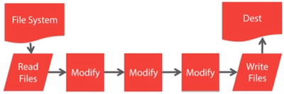

+++
title = "Gulp"
date = 2020-06-06T19:24:56+02:00
+++

**BIG PROJECTS USE NPM SCRIPTS AND BUILT-IN CLI COMMANDS INSTEAD, PERHAPS USE FOR SMALL PROJECTS ONLY**

Used to automate workflow of web development.
"Swiss Army Knife of Web Development" Quote by Bucky from TheNewBoston.

- Tool for building JavaScript applications.
- Open source JavaScript toolkit & task runner.
- Used for time consuming & repetetive tasks.

## Common Tasks

- Compile SASS to CSS
- Minifaction of scripts and styles
- Concatenation
- Cache busing
- Testing, linting, & optimization
- Development server

## How Gulp Works




The plugin takes in files from folders modifies them and then writes the files to destination folder. Pipelines `pipe()` operator. Plugins can be created and google for popular plugins.

## Types of Gulp functions

- `gulp.task` - Define tasks
- `gulp.src` - Point to files to use
- `gulp.dest` - Points to folder to output
- `gulp.watch` - Watch files and folders for changes

## Misc

`--save-dev` means it will save dependency in our `package.json` file.

## Instruction on how to setup project

Run `npm rm gulp -g` to remove any old version of gulp.

Run `npm install gulp-cli -g` to add gulp as global command interface.

Terminal command line:

`````bash
$ npm init
Initialize project, creates package.json

$ npm install gulp --save-dev
Install gulp and creates node_modules folder with bunch of dependecies.
Possibly look up why so many dependencies are made .in node_modules, cuz it did not happen to Bucky .in tutorial.

$ npm install gulp-sass --save-dev
Install sass precompiler
`````

### Create folders:

- app - for source code
- dist - generated automatically

### Running gulp tasks:

gulp <task_name>

### gulpfile.js

Create `gulpfile.js` file in project directory. An example `gulpfile.js` file is shown below.

```javascript
var gulp = require('gulp');
var sass = require('gulp-sass');

/* Template:
gulp.task('task_name', function(){
    // do something..
});

/*
    -- TOP LEVEL FUNCTIONS --
    gulp.task - Define tasks
    gulp.src - Point to files to use
    gulp.dest - Points to folder to output
    gulp.watch - Watch files and folders for changes

*/
// Pipe is chain something together
/*
Returns scss file pipe it through sass and
*/

gulp.task('sass', function(){
    return gulp.src('app/scss/styles.scss')
        .pipe(sass())
        .pipe(gulp.dest('app/css'))
});

```


## Gulp Tasks

### Default Gulp Task

The default task means when running just `gulp` in command line, this is the task that will be executed

```javascript
/*
Default task
*/
gulp.task('default', async function () {
    return console.log('Hello Gulp!');
});
```

### Simple Message

Gulp task to echo to command line.

```javascript
/*
Need to make function async
*/
gulp.task('message', async function () {
    return console.log('Hello Gulp!');
});

/*
Need done argument because it assumes the task is synchronous
*/
gulp.task('message2', function(done){
    console.log('Gulp is runninng....');
    done();
});
```

The reason for adding async is because since Gulp Verions 4.0 it is required. Here is a [Stackoverflow post](https://stackoverflow.com/questions/36897877/gulp-error-the-following-tasks-did-not-complete-did-you-forget-to-signal-async/36899424) explaining why.

### Copying Files 

Copying a certain type of file to a directory. This example all `HTML` files in `src` directory will be copied to `dist` directory.

```javascript
// Copy ALL HTML files
// dist folder created automatically
gulp.task('copyHtml', function(){
    return gulp.src('src/*.html')
        .pipe(gulp.dest('dist'))
});

```


### Sass to minified CSS

Run `npm install gulp-clean-css --save-dev` in command line to install clean-css plugin.

Run `npm install gulp-sass -—save-dev` in command line to install Sass to CSS compiler plugin.

```javascript
const sass = require('gulp-sass');
const cleanCSS = require('gulp-clean-css');

gulp.task('sass', function(){
    return gulp.src('src/scss/main.scss')
        .pipe(sass())
    		.pipe(cleanCSS())
        .pipe(gulp.dest('src/css'))
        .pipe(browserSync.stream()); // Also refreshes browser
})
```


### Image Optimizaton

Run `$ npm install gulp-imagemin --save-dev` in command line to install gulp plugin. Then `require` it in our gulp file.

```javascript
const imagemin = require('gulp-imagemin')

// Image optimization
gulp.task('imagemin', () =>
    gulp.src('img/*')
        .pipe(imagemin())
        .pipe(gulp.dest('dist/images'))
);
```


### Uglify Javascript

Run `$ npm install gulp-uglify --save-dev` 

**Note:** This does not work with ES6 and TypeScript standards, only plain JavaScript. 

**I am personally not using this one.**

```javascript
const uglify = require('gulp-uglify')

// Javascript minifying
gulp.task('minify', () =>
    gulp.src('js/*.js')
        .pipe(uglify())
        .pipe(gulp.dest('dist'))
);
```


### Minify Javascript

Run `$ npm install gulp-minify --save-dev` 

Minifies javascript files.

#### Default configuration:

**src:** `main.js` -> **dest:** `main.min-js`, `main.js`  — Basically source file is copied as well and a new minified is made.

#### My configuration (the one below):

**src:** `main.js` -> **dest:** `main.js`  — Source file isn't copied and destination is called the same as source file.

```javascript
const minify = require('gulp-minify')

// Javascript minifying
gulp.task('scripts', () => {
    return gulp.src('src/js/*.js')
        .pipe(minify({
            ext:{
                min:'.js' // Destination files will be called the same as source files
            },
            noSource: true, // Source files are not published
        }))
        .pipe(gulp.dest('js'))
});
```

### Run all tasks by default

Give the default tasks and array of tasks to execute. `gulp.series` makes the tasks run in series, one after another.

```javascript
gulp.task('default', gulp.series('message', 'copyHtml', 'imagemin'));
```


### Concat and Minify JavaScript files

Run `$ npm install gulp-concat --save-dev`

Merge all JavaScript files into one and then minify it.

```javascript
const concat = require('gulp-concat');

// Combine and minify Javascript files
gulp.task('scripts', () =>
    gulp.src('js/*.js')
        .pipe(concat('main.js'))
        .pipe(uglify())
        .pipe(gulp.dest('dist'))
);
```


### Gulp Watch

Watch specific files for changes and if changes occur run some tasks. After setting up watch task, run `gulp watch`. This will watch the files for changes and apply the tasks when changes occur. `Ctrl + C` to exit watch.

```javascript
gulp.task('watch', function(){
    // Watch all javascript files and if changes occure run scripts tasks
    gulp.watch('src/js/*.js', gulp.series('scripts'));
    gulp.watch('src/images/*', gulp.series('imagemin');
    gulp.watch('src/scss/*.scss', gulp.series('sass'));
	gulp.watch('src/*.html', gulp.series('copyHtml'));
});
```

### Browser Sync

Run `$ npm install browser-sync --save-dev`

Run `gulp browser-sync` and server starts up on localhost:3000. `Ctrl + C` to stop server.

**Note:** Look more into browser sync for auto reload, etc.

[Browsersync.io](https://browsersync.io/docs/gulp)

```javascript
const browserSync = require('browser-sync').create();

// Static server
gulp.task('browser-sync', function() {
    browserSync.init({
        server: {
            baseDir: "./"
        }
    });
});
```

### Babel

Run `$ npm install babel-core --save-dev`

Run `$ npm install gulp-babel --save-dev`

Run `npm install --save-dev @babel/core @babel/preset-env`

Run `npm install --save-dev babel-preset-es2015`

Babel is an Javascript compiler that can compile ES6 standard code (modules, etc) into ES6 standard code.


```javascript
const babel = require('gulp-babel');
const uglify = require('gulp-uglify');

gulp.task('scripts', () => {
  return gulp.src('src/**/*.js')
    .pipe(babel({
      presets: ['es2015']
    }))
    .pipe(uglify())
    .pipe(gulp.dest('dist'))
});
```

## Example 1 gulpfile.js

```javascript
const gulp = require('gulp');
const sass = require('gulp-sass');
const cleanCSS = require('gulp-clean-css');
const imagemin = require('gulp-imagemin');
const minify = require('gulp-minify');
const inject = require('gulp-inject');
const browserSync = require('browser-sync').create();
const del = require('del');

/*
Need done argument because it assumes the task is synchronous
*/
gulp.task('message', function(done){
    console.log('Gulp is runninng....');
    done();
});

// Copy ALL HTML files
// dest folder created automatically
gulp.task('copy-html', function(){
    return gulp.src('src/*.html')
        .pipe(gulp.dest('./'))
});

// Copy ALL js files
// dest folder created automatically
gulp.task('copy-js', function(){
    return gulp.src('src/js/*')
        .pipe(gulp.dest('js'))
});

// Copy ALL css files
// dest folder created automatically
gulp.task('copy-css', function(){
    return gulp.src('src/css/*')
        .pipe(gulp.dest('css'))
});

// Copy ALL css files
// dest folder created automatically
gulp.task('copy-files', function(){
    return gulp.src('src/files/**/*')
        .pipe(gulp.dest('files'))
});

// Image optimization
gulp.task('image-min', () =>
    gulp.src('src/img/*')
        .pipe(imagemin())
        .pipe(gulp.dest('img'))
);

// Javascript minifying
gulp.task('scripts', () => {
    return gulp.src('src/js/*.js')
        .pipe(minify({
            ext:{
                min:'.js'
            },
            noSource: true,
        }))
        .pipe(gulp.dest('js'))
});

// Pipe is chain something together
/*
Returns SCSS file pipe it through sass and
*/
gulp.task('sass', function(){
    return gulp.src('src/scss/main.scss')
        .pipe(sass())
        .pipe(cleanCSS())
        .pipe(gulp.dest('src/css'))
        .pipe(browserSync.stream());
});

/*
Inject CSS into HTML
Later also inject Javascript
*/
gulp.task('inject-index', function () {
    // var target = gulp.src('./src/index.html');
    // // It's not necessary to read the files (will speed up things), we're only after their paths:
    // var sources = gulp.src(['./src/css/*.css'], {read: false}, {relative: true} );

    // return target.pipe(inject(sources))
    //     .pipe(gulp.dest('./src'));

    // Pipe relative path
    return gulp.src('./src/*.html')
        .pipe(inject(gulp.src('./src/css/*.css', {read: false}), {relative: true}))
        .pipe(gulp.dest('./src'));
});

// Static server
gulp.task('serve', function() {
    browserSync.init({
        server: {
            baseDir: "./src/"
        }
    });
    
    // Make broswer sync on change in SASS and CSS
    gulp.watch("src/scss/*.scss", gulp.series('sass'));
    // gulp.watch("src/*.html", gulp.series('inject-index'));
    gulp.watch("src/*.html").on('change', browserSync.reload);
    gulp.watch("src/js/*.js").on('change', browserSync.reload);
});

// Watch can be called here separately, but it is called when gulp browser sync is started
gulp.task('watch', function(){
    // Watch all javascript files and if changes occure run scripts tasks
    gulp.watch('src/scss/*', gulp.series('sass'));
	//gulp.watch('src/*.html', gulp.series('copy-html'));
});

/* Copy all files in dist folder to project folder */
gulp.task('copy-dist', function(){
    return gulp.src('dist/**/*')
        .pipe(gulp.dest('./'))
});

gulp.task('clean', function(){
    return del(['js', 'css', 'img', 'files', 'index.html', 'favicon.ico'], {force:true});
});

gulp.task('deploy', gulp.series('clean', 'copy-dist'));

gulp.task('default', gulp.series('image-min', 'sass', 'scripts', 'inject-index', 'copy-html', 'copy-css', 'copy-files'));

```

## Example 2 gulpfile.js

```javascript
const gulp = require('gulp');
const imagemin = require('gulp-imagemin');
const del = require('del');
const exec = require('child_process').exec;
const jsonminify = require('gulp-jsonminify');
 

/*
Need done argument because it assumes the task is synchronous
*/
gulp.task('message', function (done) {
    console.log('Gulp is running....');
    done();
});

/* Run `npm run build` command inside gulp */
gulp.task('build', function (cb) {
    exec('npm run build', function (err, stdout, stderr) {
        console.log(stdout);
        console.log(stderr);
        cb(err);
    });
});

/* Minify JSON files */
gulp.task('minify-json', function () {
    return gulp.src(['dist/database/*.json'])
        .pipe(jsonminify())
        .pipe(gulp.dest('dist/database/'));
});

// Copy ALL files
// dest folder created automatically
gulp.task('copy-files', function () {
    return gulp.src('src/files/**/*')
        .pipe(gulp.dest('files'))
});

// Image optimization
gulp.task('image-min', () =>
    gulp.src('src/img/*')
    .pipe(imagemin())
    .pipe(gulp.dest('img'))
);

/* Copy all files in dist folder to project folder */
gulp.task('copy-dist', function () {
    return gulp.src('dist/**/*')
        .pipe(gulp.dest('./'))
});

gulp.task('clean', function () {
    return del(['js', 'css', 'img', 'files', 'database', 'index.html', 'favicon.ico'], {
        force: true
    });
});

gulp.task('deploy', gulp.series('build', 'minify-json', 'clean', 'copy-dist'));
```


