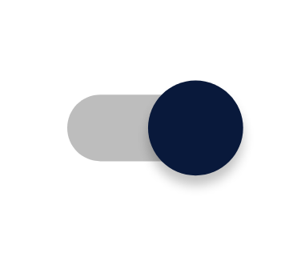

+++
title = "CSS"
date = 2020-06-06T20:00:12+02:00
+++

---

[TOC]

---

## Conventions

### Naming

Use hypen, not camelCase.

```css
.red-box {
    border: 1px solid red;
}
```

### BEM (Block-Element-Modifier)

#### Block

Block of design, like a stickman

```css
.stick-man {

}
```

#### Element

An element in the block, part of the block, for example the head, arms, feet of stickman.
Denoted with: __ (double underscore)

```css
.stick-man__head {
}
.stick-man__arms {
}
.stick-man__feet {
}
```

#### Modifier

 Modifying the block or element with a specific design, like red or blue stickman.
 Denoted with: -- (double hyphen)

```css
.stick-man--blue {
}
.stick-man--red {
}
```

##### Or

Stickman with small or big head

```css
.stick-man__head--small {
}
.stick-man__head--big {
}
```


 ## JavaScript connection with DOM

 If CSS has relationship with javascript, add js-<name-of-css> to class

`class="site-navigation js-site-navigation"`

 Source:
 [CSS Naming Conventions that Will Save You Hours of Debugging](https://medium.freecodecamp.org/css-naming-conventions-that-will-save-you-hours-of-debugging-35cea737d849)


---


## CSS Selectors

[Reference](https://www.w3schools.com/cssref/css_selectors.asp)

| Selector              | Example | Description                                    |
| --------------------- | ------- | ---------------------------------------------- |
| *element1* *element2* | div p   | Selects all <p> elements inside <div> elements |
|                       |         |                                                |


## Flexbox

https://philipwalton.github.io/solved-by-flexbox/


## CSS Grid

Source:
[CSS tricks](https://css-tricks.com/snippets/css/complete-guide-grid/)

### Basics

```css
.container{
	display: grid;
	grid-template-columns: repeat(5, 1fr); /*Creates columns, 5 equal columns*/
	/*grid-template-rows: 100px auto 200px 100px;*/
	grid-template-rows: repeat(5, 1fr); /*Creates rows, 5 equal columns*/
    grid-template: repeat(2, 50px) / repeat(3, 1fr); /*Shorthand Notations columns x rows*/
	grid-gap: 2px; /*Gap between grids*/
}
#header{
	background-color: red;
	grid-column: 3 / 5;
	grid-row: 2 / 3;
}
#navbar{
	background-color: blue;
	grid-column: 2 / -1; /* Starting  Grid line, ending grid line, (-1 means to the end)*/
	color: white;
	text-align: center;
}
#menu{
	background-color: green;
	grid-column: 1 / 2;
}
#content{
	background-color: orange;
	grid-column: 1 / 2;
}

.horizontal {
    grid-column: 1 / span 2; /*span 2 columns*/
}
```

### Template Areas

```css
.container {
    height: 100%;
    display: grid;
    grid-gap: 3px;
    grid-template-columns: repeat(12, 1fr);
    grid-template-rows: 40px auto 40px;
    grid-template-areas: 
        "m h h h h h h h h . . ."
        "m c c c c c c c c c c c"
        "f f f f f f f f f f f f";
    /* Create mini representation of layout with letters*/
}

.header {
    grid-area: h;
  /* Connects this div with template layout  */
}

.menu {
    grid-area: m;
}

.content {
    grid-area: c;
}

.footer {
    grid-area: f;
}
```

### Autofit Minmax

```css
.container {
    display: grid;
    grid-gap: 5px;
    grid-template-columns: repeat(auto-fit, minmax(100px, 1fr));
    grid-template-rows: repeat(2, 100px);
    grid-auto-rows: 100px; /*Creates rows implicitly*/
}

/*
Auto-fit makes sure that the colums fit the page with minimum of 100px for each colums
if not then 1 fraction
 /
 \
*/
```


---


## Child div should match parent div size

How to make a child DIV the same height as its parent DIV
This one is strictly for designer geeks! Every time I come across this problem I have to scour the internet to find an answer. Having found it once again, I am now inserting it into my blog to ensure that I don’t lose it again!

If you want to make a child DIV box appear to be 100% of the height of its parent (without having to fill it with content), here is the CSS code that will achieve the desired result:

```css
.parent {
	overflow: hidden;
	position: relative;
}

.child {
	height: 100%;
	width: 100%;
	position: absolute;
}
```


[How to make a child DIV the same height as its parent DIV \| Tinstar Design Studio Blog](https://tinstardesign.wordpress.com/2012/09/21/how-to-make-a-child-div-the-same-height-as-its-parent-div/)


## Keyframes

Keyframes are used to specify the behavior of the animations.

```scss
@keyframes falling {
    from { background-size: 100px 100px; }
    to { background-size: 0px 0px; }
}

@keyframes winning {
    0%   { background-position: center 5px; }
    50%  { background-position: center -5px; }
    100%  { background-position: center 5px; }
}

.tile{
    /* Robot winning animation */
    animation-name: winning;
    animation-duration: 1.0s;
    animation-iteration-count: infinite;
}
```


## Clipping

Clipping tool for clipping off parts of a `div`.

https://bennettfeely.com/clippy/

# Snippets

## [Pure CSS Dropdown Menu](https://www.w3schools.com/cssref/tryit.asp?filename=trycss_sel_hover_dropdown)

Make sure Dropdown links are inside a list item as a new unordered list.

```html
<div>
  <a href="#">Useless Link</a>
  <ul>
    <li>
      <a href="#">Dropdown Link</a>
      <ul>
        <li><a href="#">Link 1</a></li>
        <li><a href="#">Link 2</a></li>
        <li><a href="#">Link 3</a></li>
      </ul>
    </li>
  </ul>
</div>
```


## [Multiple Background Images](https://www.w3schools.com/css/css3_backgrounds.asp)

The first image will be on top while the second image will be behind it.

```css
#example1 {
  background-image: url(img_flwr.gif), url(paper.gif);
  background-position: right bottom, left top;
  background-repeat: no-repeat, repeat;
}
```


## Gradient Nav-Burger

[Inspiration🐊](https://alligator.io/css/gradient-borders-pure-css/)


```scss
$nav_burger_size: 100px;
$nav_burger_color: linear-gradient(180deg, #d48590 0%, #ecac81 100%);

.nav-burger {
  width: $nav_burger_size;
  height: $nav_burger_size * 0.6;
  
  box-sizing: content-box; /* Make sure this is default */

  border-top: $nav_burger_size * 0.2 solid;
  border-bottom: $nav_burger_size * 0.2 solid;

  border-image-source: $nav_burger_color;
  border-image-slice: 1;

  .nav-burger-meat {
    margin-top: $nav_burger_size * 0.2;
    height: $nav_burger_size * 0.2;
    background: $nav_burger_color;
  }
}

```


## Make sure height matches content height

```css
	/* Makes sure height matches content height */
	display: block;
  overflow: auto;
```


[CSS-Matic](https://www.cssmatic.com/)

## Toggle Switch

```html
<input class="toggle-switch" type="checkbox">
```

```scss
$circle_radius: 22px;

.toggle-switch {
  position: relative;
  -webkit-appearance: none;
  outline: none;
  top: 3px; /* Lower switch to align it with text */
  margin-right: 8px; /* Put space between switch and text */
  width: 42px;
  height: 16px;
  background-color: $mediumgrey;
  border-radius: 50px;
}
/* Circle part of the toggle switch */
.toggle-switch:after {
  content: "";
  position: absolute;
  top: -3px;
  left: 0px;
  width: $circle_radius;
  height: $circle_radius;
  border-radius: 50%;
  background-color: $lightgrey;
  box-shadow: 0px 2px 4px rgba(0, 0,0 , 0.4);
  transition: 0.4s ease-in-out;
  -webkit-transition: 0.4s ease-in-out;
}

/* Color of switch when checked */
.toggle-switch:checked {
  background-color: $mediumgrey;
}
/* Position of switch when checked */
.toggle-switch:checked:after {
  left: 20px;
  background-color: $blue;
}
```




## Checkbox with Fontawesome

https://codingwithspike.wordpress.com/2014/11/16/fancy-css-checkboxes-with-fontawesome/