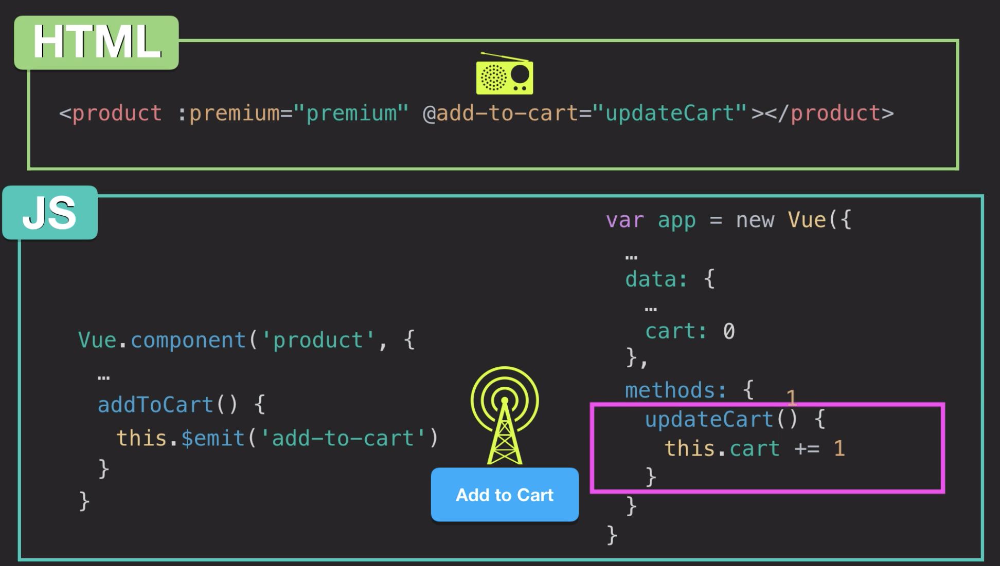

<!-- # Vue -->

Front end javascript framework to build static and dynamic websites. Vue fundamentally changes how you think of web development.

## Vue Instance

The heart of the application.

```javascript
var app = new Vue({
    el: "#app",
    data: {
      name: 'Application'
    }
})
```


### Vue Expression

Vue expressions can express all kinds of following JavaScript logic including string manipulation, tenirary operator, and built-in JavaScript functions.

```html
<h1>{{ product }}</h1>

{{ product + '!' }}
{{ firstName + ' ' + lastName }}
{{ clicked ? true : false }}
{{ message.split('').reverse().join('') }}
```


[Best Practices](https://vuejs.org/v2/style-guide/)

Look at Scrimba videos as well.

## Javascript Refresher

To turn on strict mode in Javascript add `use strict` to top of Javascript file, to omit a few warnings. Strict mode makes it easier to write "secure" JavaScript.

```javascript
"use strict"

```

Objects are like structs in other programming languages.

```javascript
var obj1 = {
	key1: "val1", // or "key1"
	key2: "val2"
}

console.log(obj1)
console.log(obj1.key1)
// console.log(obj1.key2)
// console.log(obj1["key1"])
// console.log(obj1["key2"])

// Nesting objects
var obj2 = {
 	obj3: {
 		key1: "val1",
 		key2: "val2"
 	},
 }

// console.log(obj2)
// console.log(obj2.obj3)
// console.log(obj2.obj3.key1)
// console.log(obj2.obj3.key2)
// console.log(obj2.obj3["key1"])
// console.log(obj2.obj3["key2"])


```


## Debug mode in Vue

By addign keyword `debug` to HTML element tags, it triggers debug mode for that elements and all children elements.

```html
<body debug>
    <div id="app">
        <!-- different ways to render data in DOM, most simplest: {{ }} -->
        <p>{{ message }}</p>
        <!-- v-text tag renders message as plain text -->
        <p v-text="message"></p>
        <!-- v-html tag renders message as HTML  -->
        <p v-html="message_2"></p>
    </div>
    <script>
    var app = new Vue({
        // el specifiy where in the DOM to render the app
		el: "#app",
    	data: {
        	message: "hello world!",
            message_2: "hello <br> world!"
    	}
	})
    </script>
</body>
```


## Separation of Concern

Separate data from HTML. 

Virtualization the DOM. (Virtual DOM)

Two-binding. Bind the user input and HTML element. Using v-model tag

Property is a variable attached to an object. Method is a function attached to an object.

## Template

Serves as an invisible wrapper. 

```html
<template>

</template>
```


## Directive

### v-model

Two-way binding

Two way data bindings on form input and elements. Keeps DOM and Vue app in sync.

### v-bind

One-way binding

Short version `:`

Attribute binding, binds attribute with expression in virtual DOM.

```
:alt="description"
:href="url"
:class="isActive"
```

### v-show

Just makes element display hidden, instead of not rendering it as with `v-if` and `v-else`

Makes for better performance.

```
v-show='true' 		Element is visible
v-show='false' 		Element is hidden
```

### v-on

Event Handling, such as click, hover mouse over, etc.

Short version: `@`

```
@mouseover
@click
@submit
@keyup.enter
```


## Conditional Rendering

```
<span v-if="seen > 100">ABC</span>
<span v-if-else="seen < 10 && seen > 5">DEF</span>
<span v-else>EFG</span>
```


## List Rendering

```
<div v-for="element in list" :key="element.id">{{ element.name }}</div>
```


## Communicating Events

Emit data from child components to parent component.




### [Styling with Vue](https://vuejs.org/v2/guide/class-and-style.html)


## Components

Most powerful feature a Vue. Makes code more reusable and markup more readable. Make a block of code a smaller block of code.

Best practice: HTML elements without hypens, Vue components name with hyphens.

[Component Lifecycle](https://alligator.io/vuejs/component-lifecycle/)

```javascript
/* created(): since the processing of the options is finished you have access to reactive
data properties and change them if you want. At this stage DOM has not been mounted or
added yet. So you cannot do any DOM manipulation here. Typically used for data fetching */
created() {
},
/* mounted(): called after the DOM has been mounted or rendered. Here you have access to 
the DOM elements and DOM manipulation can be performed for example get the innerHTML: 
*/
mounted() {
},
```


Components are like HTML functions. When a component is created, you essentially make a custom HTML tag. The `props` field represents property, which you set inside the component's HTML tag. The `:` in `:name` indicates that it is a Vue attribute. So the value you give to `:name` is looked for in th  Vue apps `data` field.

```html
<animal :name="dog"></animal>

<script>

Vue.component("animal", {
	props: ["name"],
	template: '<p v-html="name"></p>'
})
    
var app = new Vue({
	el: "#app",
    data: {
		dog: "Doggy!",
		cat: "Kitty!!",
		bird: "Birdy!!!" }
})

</script>
```


`@click` triggers when clicked on, `:class` chooses which class is this element belongs to, used for styling.

```html
<div id="app" :style="{ background: background() }">
    <p v-html="actice" @click="animagus" :class="breathe()"></p>
</div>
```


## Control-Flow

The way we control the flow of the program through conditional statements and loops.

# Lessons

## [Prevent on click on parent when clicking button inside div](https://stackoverflow.com/questions/45700632/prevent-on-click-on-parent-when-clicking-button-inside-div)

[Event modifier](https://vuejs.org/v2/guide/events.html#Event-Modifiers), `@click.stop` is placed on child element, in order for parent element click not to fire.

```html
<li v-for="tab in tabs" class="nav-item" :id="tab.name" @click="currentTab = tab.name">
					{{ tab.name }}
					<ul v-if="tab.subtabs != null" class="sub-menu">
						<ul v-for="subtab in tab.subtabs" class="submenu-item" :id="subtab.name" @click.stop="currentTab = subtab.name">
							{{ subtab.name }}
						</ul>
					</ul>
				</li>
```

## [Timeout in Vue js component](https://stackoverflow.com/questions/37465289/how-to-set-timeout-in-a-vuejs-method)

Add a `bind()` call to your function declaration:

```javascript
setTimeout(function () { this.fetchHole() }.bind(this), 1000)
```

So that your Vue component's this is accessible within the function.

## Environmental Variables

https://cli.vuejs.org/guide/mode-and-env.html

https://medium.com/js-dojo/how-to-use-environment-variables-in-vue-js-273eba0102b0

Make sure you name the environmental variables starting with `VUE_APP_` in order for it to work.